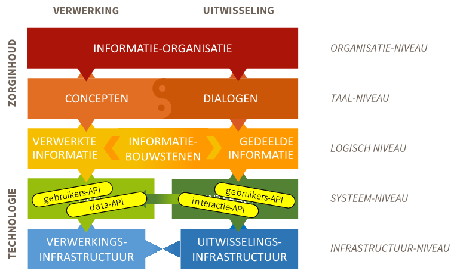

# Een API-strategie voor de zorg

## Strategisch aandacht voor API's

### Data beschikbaar voor hergebruik

API's (application programming interfaces) zijn technische koppelvlakken binnen en tussen digitale informatiesystemen.
Zij ontsluiten data en transacties: de data die door die systemen worden vastgelegd en de transacties die door die
systemen worden uitgevoerd. Voor data en transacties worden aparte typen API's onderscheiden. Data-API's zorgen voor
technische *databeschikbaarheid*[^1]: zij ontsluiten data buiten transacties om. Zo onthullen zij op een gecontroleerde
manier gegevens uit het ene systeem voor hergebruik door het andere systeem. Dat maakt data-API's van strategisch belang
voor het zorginformatiestelsel.

[^1]: Zie ook [API's voor databeschikbaarheid](./api-architectuur.md#apis-voor-databeschikbaarheid).

### Standaardisatie van informatie

In het zorginformatiestelsel worden informatiestandaarden - voor hetzij registratie, hetzij uitwisseling - ontwikkeld en
beheerd door verschillende partijen en met verschillende eindverantwoordelijke houders. Elke informatiestandaard is
bedoeld voor een zorgsituatie of *use case* en beschrijft:

- in gebruikerstaal wat er aan de orde is (conceptueel);
- de gegevensset die daaraan invulling geeft (logisch);
- de API's waarlangs informatiesystemen die gegevenssets uitwisselen (technisch).

Daarmee vervullen data- en transactie-API's een sleutelrol in de *standaardisatie van informatie* in het
zorginformatiestelsel.

### Samenhang tussen informatiestandaarden

Het is van groot belang dat informatiestandaarden samenhangen. Dat borgt hun gebruiksvriendelijkheid en
implementeerbaarheid. Eenzelfde zorgmedewerker is immers betrokken in vele zorgsituaties; diens informatiesysteem ook,
maar weer in andere combinaties. Dat is nu al het geval en dat zal alleen maar toenemen door voorziene ontwikkelingen
naar passende zorg en hybride zorg. Passende zorg vraagt om intensievere samenwerking en hybride zorg vraagt meer
digitale middelen, die naadloos aansluiten bij de fysieke zorgverlening.

Samenhang tussen informatiestandaarden vereist dat hun gegevenssets zijn samengesteld uit dezelfde
*zorginformatiebouwstenen*. Die bouwstenen zijn dan per stuk herkenbaar voor zorgverleners en implementeerbaar in
informatiesystemen – los van de specifieke zorgsituatie en het zorginformatiesysteem. API's kunnen dan net zo worden
samengesteld uit technische fragmenten, als gegevenssets bestaan uit zorginformatiebouwstenen[^2]. Daarmee spelen API's op
systeemniveau een strategische rol in de *samenhang in specificatie* van het zorginformatiestelsel.

[^2]: Een actueel voorbeeld hiervan is opgenomen in [Bijlage A](./apis-en-informatiebouwstenen-voorbeeld.md).

### Scheiding tussen API-specificatie en API-implementatie

Binnen een zorginformatiestelsel is eerst belangrijk wat digitale systemen doen en daarna hoe. In softwarekringen maakt
men daarvoor onderscheid tussen een API-specificatie en een API-implementatie. Een API-specificatie is een document
waarin precies staat wat een API te bieden heeft. Een API-implementatie is de software die doet wat de API-specificatie
zegt. Deze scheiding is van strategisch belang voor de regievoering op het zorginformatiestelsel. Zij maakt het mogelijk
om precieze afspraken te maken en besluiten te nemen (regie te voeren) over wat er nodig is los van de vraag hoe de
software moet worden gebouwd.

De scheiding tussen specificatie en implementatie heeft op termijn een tweede strategisch effect. Zij maakt het mogelijk
om vanuit eenzelfde API-specificatie verschillende softwareleveranciers verschillende API-implementaties te laten
bouwen. Dit bevordert een open softwaremarkt. Dit vraagt wel een inhoudelijk rijk genoeg gedocumenteerde
API-specificatie, die willekeurige softwareontwikkelaars mogen gebruiken zonder juridische beperkingen. Net zoals bij
open standaarden.

*Implementatie-onafhankelijkheid* van API-specificaties is geen eis vanaf het prille begin. Het is een actief te
bevorderen kwaliteit in een voldoende volwassen softwaremarkt. Dit komt omdat API-specificaties doorgaans pas op papier
komen nadat er een (eerste) implementatie is gemaakt. Dit geldt zeker in innovatieve domeinen waarin standaardisatie nog
minder vergevorderd is.

### Technologie-gedreven innovatie

API's zijn dus strategisch belangrijk voor databeschikbaarheid, voor standaardisatie en voor samenhang in specificatie.
Toch is de grote rol van API's op deze punten uiteindelijk niet leidend maar dienend. Dat betekent dat een API-strategie
(op systeemniveau) voor de verwezenlijking van haar doelen kritiek afhankelijk blijft van andere deelstrategieën van het
zorginformatiestelsel, op hogere niveaus (afbeelding 1)[^3]. Technologie kan de rol van die hogere niveaus onmogelijk
overnemen. Technologie kan wél de noodzaak van die andere deelstrategieën duidelijker maken.

*Afbeelding 1: Positie van API's in het zorginformatiestelsel.*

Een zorginformatiestelsel dat inzet op passende en hybride zorg moet de kracht van API's inzetten op het juiste niveau.

Digitale technologie is en blijft een middel voor informatiegebruiksdoelen. Toch kunnen API's een krachtige en welkome
rol spelen in het uitdagen en ontdekken van nieuwe informatiebehoeften. Via API's kunnen data en transacties technisch
beschikbaar komen: nog voordat deze op de hogere niveaus gespecificeerd en gestandaardiseerd zijn en nog voordat deze
implementatie-onafhankelijk zijn. Een API-strategie voor de zorg moet ook deze technologie-gedreven innovatiekracht van
API's haar werk laten doen. Maar ze moet er wel voor blijven zorgen dat API's uiteindelijk altijd ondergebracht worden
in expliciete informatiebehoeften, implementatie-onafhankelijk.

[^3]:
    Het model op de achtergrond is een verfijning van het lagenmodel van Nictiz voor interoperabiliteit.
    [Bijlage B](./toelichting-op-de-verfijning-van-het-vijflagenmodel.md) licht de relatie tussen de modellen preciezer
    toe.

### Wat voorafging

De ontwikkeling van een API-strategie voor het zorginformatiestelsel heeft Nictiz ter hand genomen, in samenwerking met
vele anderen. Dit is een vervolg op een eerder door Nictiz uitgebracht advies aan het Ministerie van Volksgezondheid,
Welzijn en Sport (VWS). Dat advies werd gevraagd in de context van de beantwoording van Kamervragen over het
wetsvoorstel Wegiz (Wet Elektronische gegevensuitwisseling in de zorg).

## Doel en groeipad van een API-strategie

### Doel

Databeschikbaarheid vraagt om meer dan alleen data technisch bevrijden uit systemen. Dan komt de data namelijk alleen in
ruwe technische vorm beschikbaar, zonder dat duidelijk is of en hoe die data bruikbaar is buiten het systeem. Daarom
moet een API-strategie niet alleen streven naar inzet van meer API's, maar ook naar inzet van goede API's: API's die
data (en transacties) zo beschikbaar stellen dat zij bruikbaar zijn in expliciete zorginformatiebehoeften. Een
API-strategie moet die bruikbaarheid dus definiëren en bevorderen.

> Het doel van de API-strategie is: inzet van meer goede API's.

### Groeipad

Goede API's maken data en transacties vrij die bruikbaar zijn in de context van de informatiebehoeften van de zorg.
Zoals in [paragraaf 1.1](#strategisch-aandacht-voor-apis) benadrukt, zijn API's voor die gebruikskwaliteit afhankelijk
van afspraken op de hogere niveaus: het logische niveau, het taal- en het organisatieniveau. Dat speelt niet alleen bij
databeschikbaarheid maar ook bij de standaardisatie, en bij gebruiksvriendelijkheid en implementeerbaarheid van die
standaarden.

Toch beperkt een API-strategie zich er niet toe eenvoudigweg te stellen dat API's moeten passen in afspraken op hogere
niveaus. Daarmee zouden kansen worden gemist op welkome en passende technologie-gedreven innovatie
([paragraaf 1.1](#strategisch-aandacht-voor-apis)). Bovendien zou dat de mogelijkheid ontnemen om actief strategie te
voeren op de *groei* van de kwaliteit van API's.

Daarom hanteert de API-strategie een groeipad voor API's langs drie treden. Op de eerste trede stelt de API-strategie
eisen aan de documentatie van de API-specificatie, als minimale kwaliteit om op voort te bouwen. Zonder geschikte
documentatie mist een API elk aangrijpingspunt voor groei. Op de tweede trede stelt de API-strategie ook technische
eisen aan API's. Hier kunnen API's groeien in interoperabiliteit en implementeerbaarheid, zonder een afhankelijkheid van
hogere niveaus (het logische niveau, het taal- en het organisatieniveau). Die afhankelijkheid bestaat wel op de derde en
hoogste trede (afbeelding 2).

Het doel van de API-strategie is om veel API's te verwelkomen op de eerste trede van het groeipad en deze te stimuleren
in hun groei naar hogere treden. Vanzelfsprekend kunnen API's ook onmiddellijk instappen op hogere treden, wanneer zij
aan desbetreffende eisen voldoen.

Langs dezelfde treden groeien API's in hun implementatie-onafhankelijkheid
([paragraaf 1.1](#strategisch-aandacht-voor-apis)). Op de eerste twee treden wordt die nog niet vereist maar op de derde
wel. Zo staat de API-strategie zo lang mogelijk open voor technologie-gedreven innovatie en ziet zij het
implementatie-onafhankelijk worden van API's als volwassen worden. Maar groei is niet verplicht. Het staat een
specificerende partij vrij om daarvan af te zien (en een API op een eerste of tweede trede te laten).

Er zijn autoriteiten nodig die de inhoudelijke standaarden vaststellen waarop een API wordt beoordeeld voor de derde
trede. Het valt buiten de scope van de API-strategie om deze autoriteiten te benoemen, maar op de derde trede is de
API-strategie wel van hun werk afhankelijk.

Een volledig gestandaardiseerde API (op de derde trede) geniet die status alleen voor de inhoudelijke
informatiestandaard waarop de API is beoordeeld. Zo kan het voorkomen dan een API vaker voorkomt op trede drie namelijk
voor verschillende informatiestandaarden (waarvoor de API geschikt is bevonden).

## API-speelveld en krachten

### API specifiers en API developers

Een effectieve API-strategie houdt rekening met diverse rollen van partijen op het API-speelveld. Zo zijn er de *API
specifiers* die de API-specificatie schrijven. De *API developers* zijn de partijen die de software leveren waarin die
API's zijn ingebouwd.

Als een softwareleverancier specificeert welke API's zijn software biedt, dan vervult deze leverancier beide rollen. Het
kan ook voorkomen dat een standaardisatie-organisatie een API standaardiseert (als API specifier), waarna meer
softwareleveranciers die API inbouwen in hun software (als API developers).

Bij de dagelijkse inzet van de API's is er een aanbiedend systeem (de server) en een afnemend systeem (de client). Beide
zijden moeten eerst geïmplementeerd zijn. Daarom worden de *API server developer* en de *API client developer* als
aparte rollen onderscheiden. Bevinden server en client zich binnen eenzelfde (informatie)systeem, dan vervult een API
developer beide rollen.

### API server deployers en API client deployers

Degene die verantwoordelijk is voor de dagelijkse inzet van een API is de *API deployer*. Een softwareleverancier
bijvoorbeeld is als API developer niet verantwoordelijk voor de dagelijkse inzet van de API's uit zijn software. Een
gebruikersorganisatie als klant van een softwareleverancier kan deze rol vervullen. Steeds vaker echter draagt een derde
partij deze verantwoordelijkheid, als dienstverlener aan de gebruikersorganisatie.

Ook hier is sprake van een aanbiedend (server) en een afnemend systeem (client). Daarom bestaat er een rol die
verantwoordelijk is voor de dagelijkse inzet van de API's aan de server-kant en een rol die verantwoordelijk is voor de
inzet van de API's aan de client-kant: de *API server deployer* en *API client deployer*. Betreft het API's binnen
eenzelfde systeem, zullen de API server deployer en de API client deployer dezelfde partij zijn.

### API agreement holder

Tot slot moeten de twee uitwisselende partijen (de API server deployer en de API client deployer) een API-overeenkomst
aangaan om elkaar te kunnen vertrouwen. Als de API server deployer en de API client deployer dezelfde partij is, is de
'overeenkomst' een besluit in de software-architectuur van die partij. Deze partij is daarmee de *API agreement holder*.
Zijn het twee verschillende partijen dan zijn zij samen de API agreement holder. Een laatste mogelijkheid is dat een
grote groep collectief (omschreven) API's van elkaar gebruikt. Dit gebeurt bij een afsprakenstelsel als MedMij. In zo'n
situatie is een derde partij de API agreement holder, waarmee alle API server deployers en API client deployers een
deelnemersovereenkomst aangaan.

### Speelveld

De API-overeenkomst − in welke variant dan ook − verwijst naar de API-specificatie(s). Daarmee is het speelveld rond
(afbeelding 3). De vier hoeken in het speelveld zijn onderling afhankelijk. In één API-overeenkomst kunnen meerdere
API-specificaties voorkomen. Een API-specificatie kan worden uitgewerkt in verschillende API-implementaties en er kunnen
meer partijen verantwoordelijk zijn voor het dagelijks gebruik van software waarin de API's zijn ingebouwd (meer API
deployers voor een API-implementatie).

### Belangenbeleid

Tussen de vier hoeken in dit API-speelveld werken krachten die desbetreffende zijde van het vierkant kenmerken.
Belangen, verbonden aan informatiegebruik, brengen API deployers ertoe samen een API-overeenkomst of
uitwisselovereenkomst aan te gaan. Een API-strategie die de totstandkoming van API-overeenkomsten wil bevorderen, moet
invloed uitoefenen op deze belangen. Die kunnen gaan over informatiebehoeften, financiële voorwaarden of een wens van
een API deployer om aan te sluiten bij een grote collectieve overeenkomst (strategisch belang).

### Architectuurbeleid

Om de API-specificaties binnen één API-overeenkomst samen de belangen van de deployers te laten dienen, en om
API-specificaties te standaardiseren voor hergebruik in meerdere API-overeenkomsten, is architectuurbeleid nodig. In
[hoofdstuk 2](./api-architectuur.md) van dit document worden daarvoor de fundamenten gelegd (afbeelding 1).

*Afbeelding 4: Positie van API's in het zorginformatiestelsel.*

### Kwalificatiebeleid

API-specificaties (en daarmee API-overeenkomsten die ernaar verwijzen) worden werkelijkheid als zij worden ingebouwd in
API-implementaties. Om te bevorderen dat er gekwalificeerde of goed bevonden API-implementaties beschikbaar komen,
moeten een API-strategie kwalificatiebeleid voeren. Bijvoorbeeld door API-specificaties goed beschikbaar te maken voor
API developers of door hen te ondersteunen bij het implementeren. Een in software ingebouwde API kan men toetsen op haar
voldoen aan de API-specificatie. Zo kwalificeert een API-specificatie software op diens compliance aan de specificatie.

### Softwaremarktbeleid

API-implementaties moeten op een gezond functionerende softwaremarkt beschikbaar komen voor gebruik door API deployers.
Rolkeuzes van softwarepartijen bepalen voor een belangrijk deel de krachten op deze markt. Zo is menig softwarepartij
tegelijk API specifier, API developer als API deployer. Een API-strategie die de beschikbaarheid van API-implementaties
wil bevorderen, kan beleid voeren op die rolverdelingen. Andere mogelijkheden zijn de transparantie van de markt
vergroten, inkoopsamenwerking organiseren of eisen stellen aan toegang van softwarepartijen tot die markt.

## Middelen van de API-strategie

De API-strategie zet vooralsnog drie strategische middelen in: API-eisen, een API-technologie-agenda en een
API-bibliotheek. Zoals in [paragraaf 1.3](#api-speelveld-en-krachten) beschreven bestaan in het speelveld vier soorten
beleid: rond belangen, architectuur, kwalificatie en softwaremarkt. Een API-strategie richt zich primair op
architectuur- en kwalificatiebeleid. Van een API-strategie kan amper eigenstandig effect worden verwacht op
gebruiksbelangen en softwaremarkt. Gebruiksbelangen tussen API deployers beginnen immers op het organisatie- en
taalniveau (afbeelding 1) en eindigen op systeemniveau. Het organisatie- en taalniveau liggen buiten bereik van een
API-strategie. Dat wil niet zeggen dat een API-strategie hier geen bijdrage kan leveren, maar wel dat die bijdrage
alleen effectief kan worden in de context van breder stelselbeleid.

Softwaremarktbeleid op haar beurt is niet alleen een API-aangelegenheid. Software omvat veel meer dan API's, zoals
eindgebruikersfunctionaliteit. Ook dat ligt buiten bereik van een API-strategie. Opnieuw geldt dat een API-strategie
hier kan en moet bijdragen, maar pas effectief kan worden in de context van algemeen softwaremarktbeleid.

### API-eisen

De API-specificatie verbindt architectuur- en kwalificatiebeleid (afbeelding 3) en vormt daarmee de spil van de
API-strategie. Niet voor niets is een goede documentatie van die API-specificatie een minimumvereiste in het groeipad
voor API's (afbeelding 2). De API-strategie voert architectuurbeleid door *API-eisen* te formuleren op de drie treden
van dat groeipad.

De API-eisen zijn het eerste strategisch middel van de API-strategie. Op de eerste trede betreffen deze eisen vooral de
documentatie van de API-specificatie; op de hogere treden spelen ook de andere verschijningsvormen van API's: de
API-implementatie, de API-inzet en de API-overeenkomst. Steeds worden de eisen verbonden aan een specifieke rol uit
afbeelding 3. Zo wordt elke partij in het API-speelveld aangesproken op de API-eisen die zijn verbonden aan precies die
rollen die deze partij speelt. Deze precisie maakt dat de API-strategie accuraat kan beïnvloeden en bevordert dus haar
effectiviteit.

### API-technologie-agenda

De API-strategie moet een 'rollende' *API-technologie-agenda* opstellen en onderhouden. Deze agenda wijst voortdurend
aan welke API-paradigma's en -technologiestandaarden van belang zijn op de tweede trede van het groeipad voor API's
(afbeelding 2). Dat betekent dat er specifieke API-eisen kunnen bestaan voor elk API-paradigma dat, en elke
API-technologie die, op enig moment op de API-technologie-agenda staat.

Op de tweede trede van het groeipad voor API's stelt de API-strategie eisen aan de technische standaardisatie van API's.
Op die trede moet de API-strategie rekening houden met een actuele en structurele diversiteit in API-technologieën en
hoe die fundamenteel zijn opgezet (de API-paradigma's). Dit maakt het (om diverse redenen) riskant om in het
zorginformatiestelsel te kiezen voor slechts een van dergelijke API-paradigma's en -technologieën.

Om te beginnen kennen data-API's van nature een andere opzet dan transactie-API's. Maar ook binnen deze categorieën
bestaan wezenlijke verschillen tussen API-paradigma's. De zogenoemde REST-paradigma doet momenteel opgeld voor
data-API's. Ook oudere paradigma's zijn nog steeds zeer gangbaar en aan de horizon melden zich nieuwe paradigma's. En zo
bestaan ook voor transactie-API's die diversiteit en evolutie.

De interoperabiliteit en implementeerbaarheid van het zorginformatiestelsel vragen erom voortdurend selectief te zijn in
de keuze uit de op enig moment gangbare en voorhanden API-paradigma's en -technologieën. Daarbij moeten terdege rekening
worden gehouden met de *installed base*: de op basis van vroegere keuzes in gebruik genomen API-implementaties. Die kan
niet zomaar afgeschreven worden, wel gaandeweg aangepast of vervangen.

Mocht het Nederlandse zorginformatiestelsel zich toch willen vastleggen op slechts een technologische standaard, dan
komt ooit het moment waarop die keuze moeten worden herzien. Dan staat het stelsel voor een enorme transitie-uitdaging.
Een bijkomende keuze voor bijbehorende logische standaarden maakt die transitie bijna ondoenlijk: de transitie vraagt
dan ook een herontwerp op de hogere niveaus. Dat is een reden om bij voorkeur een duidelijke scheiding aan te houden
tussen de gegevensinhoudelijke en de technische standaardisatie (afbeelding 1).

Standaardisatie van specifieke API-technologieën vindt (ook wereldwijd) vooral plaats per maatschappelijke of
economische sector. Als internationale standaardisatieorganisatie voor het zorgdomein kent HL7 zelf standaarden voor
verschillende paradigma's, waaronder FHIR voor onder andere het REST-paradigma. De technologische praktijk is en zal
waarschijnlijk divers en evoluerend blijven: niet zorg-specifiek, wel internationaal.

Een API-technologie-agenda opstellen en onderhouden is niet alleen een technologische aangelegenheid. Er zijn
substantiële belangen, risico's en kosten mee gemoeid op de schaal van het hele zorginformatiestelsel. Zo'n agenda
vaststellen is daarmee een wezenlijk aandachtpunt voor de partij die als houder van de API-strategie gaat optreden.
Zolang deze partij niet is aangewezen en een API-technologieagenda voorlopig ontbreekt, kan men op voorhand beginnen met
API-eisen voor REST API's en mogelijk daarna met een paradigma voor transactie-API's. Deze twee paradigma's zijn
gangbaar en zullen dat waarschijnlijk nog enige tijd blijven.

Zie hiervoor ook [paragraaf 2.3](./api-architectuur.md#api-paradigmas-en-technologiestandaarden).

### API-bibliotheek

Om met de API-eisen effect te sorteren in het API-speelveld (afbeelding 3), moet de API-strategie kwalificatiebeleid
voeren. Het is nodig de API-eisen en de achterliggende API-technologie-agenda te publiceren en toe te lichten. Daarnaast
sorteert de API-strategie gerichter effect door ook te communiceren *wat* voldoet aan de API-eisen.

1. Door te communiceren welke *API-specificaties* voldoen aan de zekere API-eisen, biedt de API-strategie aan API
  agreement holders de mogelijkheid vertrouwde API-specificaties op te nemen in hun API-overeenkomsten. Dit bevordert de
  adoptie van gestandaardiseerde API's. Bovendien kan de wetgever zo nodig putten uit deze bibliotheek om zulke
  API-specificaties te normeren en te verplichten.
2. Door te communiceren welke *API-implementaties* voldoen, biedt dat API deployers inzicht in het te vertrouwen aanbod
  op de softwaremarkt en stimuleert dat een competitieve softwaremarkt tot aanbod van meer goede-API-implementaties.
  Daarnaast stimuleert die duidelijkheid kennisdeling tussen API developers en biedt dat API specifiers inzicht in de
  implementeerbaarheid van hun specificaties.
3. Door te communiceren welke *API (server) deployments* voldoen aan zekere API-eisen, krijgen API client deployers de
  mogelijkheid met deze API (server) deployers een API-overeenkomst aan te gaan en zo een nieuwe uitwisseling te
  realiseren.
4. Door helderheid over welke *API-overeenkomsten* voldoen aan de API-eisen, biedt dat API deployers de gelegenheid zich
  aan te sluiten bij zo'n overeenkomst (voor zover de desbetreffende API agreement holder daarvoor openstaat).

Daarvoor ontwikkelt en onderhoudt de API-strategie een publiek ontsloten *API-bibliotheek*. De API-bibliotheek biedt aan
de API-strategie zelf voortdurend overzicht over de huidige situatie en haar eigen effectiviteit.

Om de inhoud van de API-bibliotheek te beheren is het nodig de verschillende verschijningsvormen van API's (zoals
API-specificaties en API-implementaties) te toetsen op hun voldoen aan API-eisen. Hoe dat moet plaatsvinden valt nog te
bepalen (onafhankelijke toetsing; zelfverklaring; anderszins).